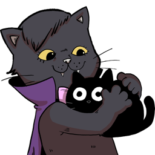

  <ul align="center" style="list-style: none;">
    

      <h1>Sopy</h1>
    

  </ul>

## 👤 About me:

I'm a self-taught developer from Romania, currently pursuing a degree in Control and Automation Engineering.

Trying my best to build a shell I'd not hate to use.

I love open-source, and I'm passionate about technology, always. I dream of changing the world, one line of code at a time. Contributing as much as I can to projects that I find interesting and useful.

Building random stuff, learning new things, and helping others is what I do best. I'm always looking for new opportunities to grow and learn.

### Contact me ✒️

- Email: [doimpt@sopy.one](mailto:doimpt@sopy.one)
- LinkedIn: [in/sopy](https://www.linkedin.com/in/sopy/)

### Projects I work/worked on 🖱️

- **[Sheesh](https://github.com/sopyb/sheesh)** 🛠️ Current Focus 🌲 Major contributions 
  - Trying to build a shell in Rust that's POSIX compliant using some things I learned working on LLVM.
- **[LLVM](https://github.com/llvm/llvm-project)** 🔕 Inactive 💧 Small contributions
  - Wrote a clang-tidy modernizer check looking for `std::min` and `std:max` calls that can be replaced with initializer lists. For the contribution phase of the internship.
  - During the internship, I learned about the Aarch64 backend: Tablegen, SelectionDAG and GlobalISel. I addressed a missing optimization in the Aarch64 backend where two large shifts and a combine could be simplified to a combine and a single shift.
- **[NavigoLearn](https://github.com/navigolearn)** 🪦 Stepped away 🌲 Major contributions 
  - Community-driven platform for learning and teaching programming. Helping answer the question "Where do I start?".
  - Worked mainly on the backend, implementing the API and the database schema, but I also helped debug some Safari and Firefox related bugs on the frontend.
- **[VHEditor](https://github.com/vhqtvn/VHEditor-Android)** 🔕 Inactive 🌱 Moderate Contributions
  - A easy way to run code-server on Android. Implemented miscellaneous features and fixed a GitHub auth bug.
- Other small personal projects here and there

### Languages and Tools 🛠️

- **Proficient:** C, C++, JavaScript, Kotlin
- **Competent:** Rust, Nix DSL, Python, Java, C#, PHP, SQL, Bash
- **Familiar:** Go, Powershell, Zsh
- **Version Control & CI/CD:** Git, GitHub Actions
- **Containers & Deployment:** Docker, Nix
- **IDEs & Editors:** JetBrains IDEs, Visual Studio Code, Unity
- **Operating Systems:** Linux, Windows
- **Miscellaneous:** Krita, FL Studio

### Frameworks & Databases 📦
- **Frontend:** React, Svelte, Bootstrap, TailwindCSS
- **Backend:** Express, Spring Boot, Laravel, Django
- **Mobile:** React Native, Android SDK
- **Embedded:** Arduino, STM32Cube
- **SQL:** MariaDB, MySQL, SQLite, PostgreSQL
- **NoSQL & Realtime:** MongoDB, Firebase, Redis

### Hobbies 🎨

- **Music Production:** I love making music, mostly electronic dance music, I love to mix genres up.
- **Gaming:** I play games from time to time, mostly CS2, Beat Saber and Plants vs Zombies nowadays.
- **Hardware Hacking:** I love to tinker with electronics, Nothing like getting inside your childhood console to mod it.
- **Photography:** I love taking photos of nature, I'm not a professional, but I enjoy it.
- **Writing:** I write poetry, it helps me understand my feelings when I am stuck.

### Stats 📊

