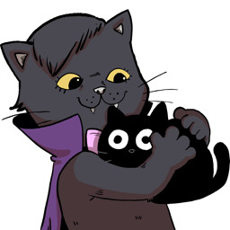

  <ul align="center" style="list-style: none;">
    

      <h1>Sopy</h1>
    

  </ul>

## About me 👤

I'm a self-taught developer from Romania, currently pursuing a degree in Control and Automation Engineering.

I love open-source and I'm passionate about technology, my motto is "Changing the world, one line of code at a time".

I'm also the **Regional Representative of [NGI0](https://nlnet.nl/NGI0/) in Romania**, helping connect local developers and projects with funding and initiatives. You can follow the regional account on Mastodon at [@NGIZero_Romania@social.ngi.eu](https://social.ngi.eu/@NGIZero_Romania).

Building random stuff, learning new things, and helping others is what I do best. I'm always looking for new opportunities to grow and learn.

### Contact me ✒️

- Email: [doimpt@sopy.one](mailto:doimpt@sopy.one)
- LinkedIn: [in/sopy](https://www.linkedin.com/in/sopy/)
- Matrix: [@sopyb:catgirl.cloud](https://matrix.to/#/@sopyb:catgirl.cloud)

### Projects 🖱️

- **[LLVM](https://github.com/llvm/llvm-project)** 🔕 Inactive 💧 Small contributions
  Submitted a couple of patches during my [Outreachy](https://www.outreachy.org/) internship: a clang-tidy modernizer check and an Aarch64 backend optimization simplifying two large shifts and a combine into a single shift.

- **[NavigoLearn](https://github.com/navigolearn)** 🪦 Graveyarded project 🌲 Major contributions
  Community-driven platform for learning programming. Was involved from the beginning to the end, working mainly on the backend API and database schema.

- **[VHEditor](https://github.com/vhqtvn/VHEditor-Android)** 🔕 Inactive 💧 Small contributions
  Easy way to run code-server on Android. Contributed a couple of patches, fixing a GitHub auth bug and adding some small features.

### Hobbies 🎨

- **Music Production:** I love making music, mostly electronic dance music, I love to mix genres up.
- **Gaming:** I play games from time to time, mostly single-player or co-op titles, like GTFO, Beat Saber, Watch_Dogs, CS2, and Plants vs Zombies.
- **Hardware Hacking:** I love to tinker with electronics, Nothing like getting inside your childhood console to mod it.
- **Photography:** I love taking photos of nature, I'm not a professional, but I enjoy it.
- **Writing:** I write poetry, it helps me understand my feelings when I am stuck.

### Stats 📊

